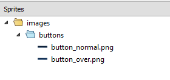

<h3>Making atlases with [TexturePacker](https://www.codeandweb.com/texturepacker)</h3>

Let's have an example Animate document with such library structure:

Here we have one component with linkage name "Button".

After we run JSFL-script and choose a folder for export, we will get such files structure in it:

* **Button.json**
* **images** *folder*
* * **buttons** *folder*
* * * **button_normal.png**
* * * **button_over.png**

Now we create a new document in TexturePacker with such settings:

* **Data Format:** Phaser 3

This is easy =)

* **Trim srpite names:** checked

This will remove file extensions from frame names.

* **Prepend folder name:** checked

This will prepend our **images/** folder to frame names

Two last settings are required for ComponentClip to find frames in the atlas properly.

*You can set other settings as you need, 
[read more](https://www.codeandweb.com/texturepacker/tutorials/how-to-create-sprite-sheets-for-phaser3).*

Add our `images` folder to the sprite list. It will look like this

Ok. We are ready to publish. Click "Publish sprite sheet". 

